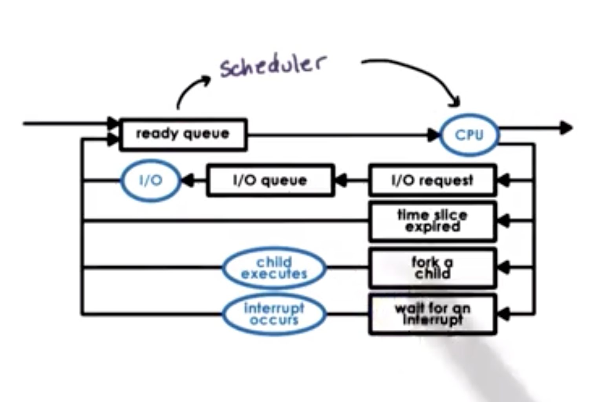
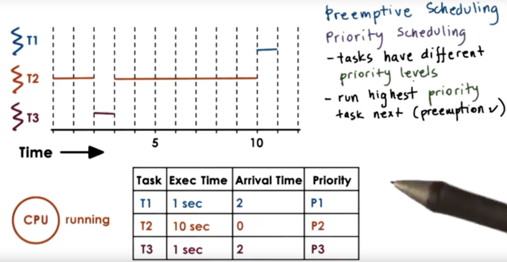
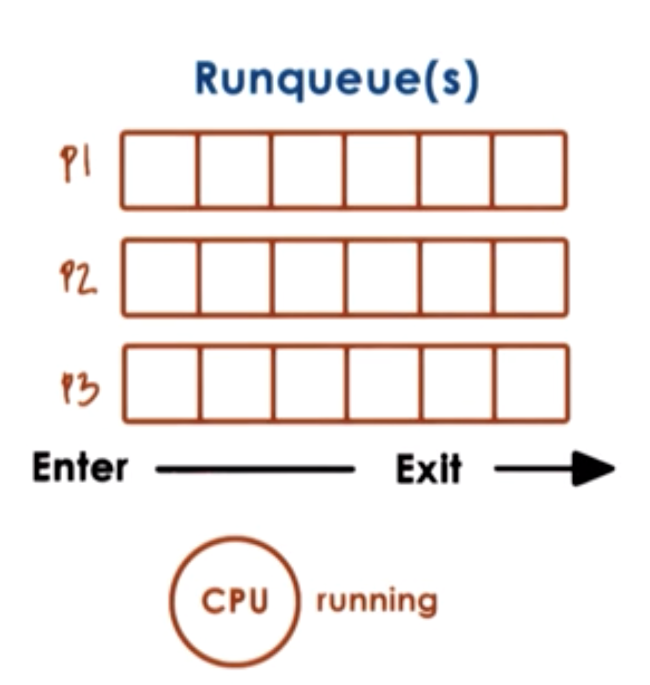
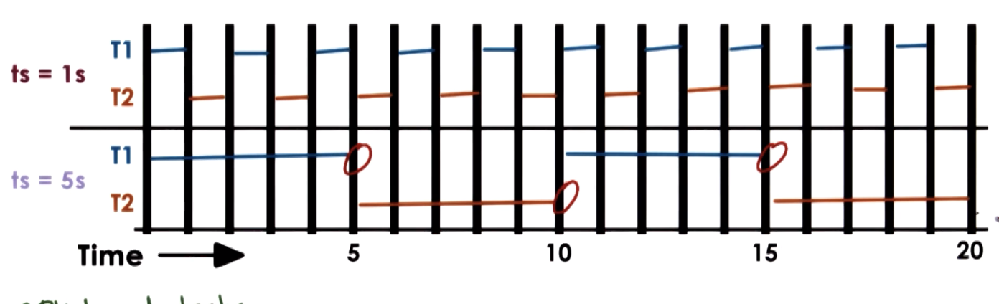
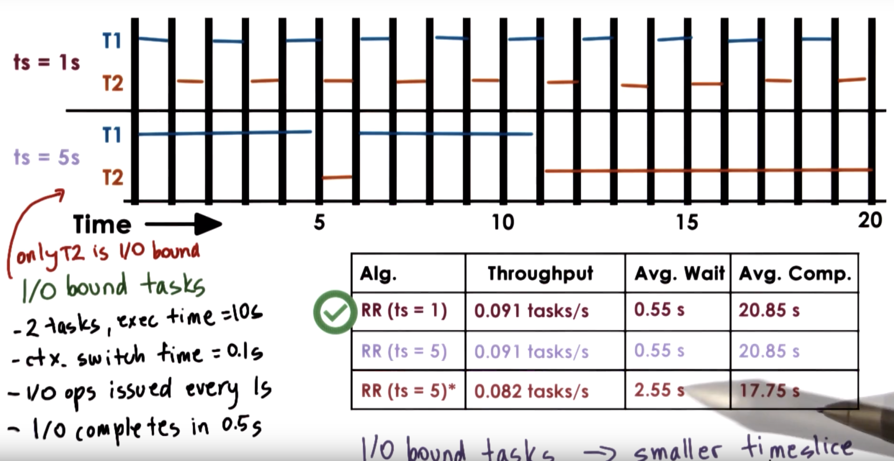

# Lesson 11 - Scheduling

## OS Scheduler

Schedules work for the CPU.

The scheduler could:

* dispatch immediately
  * FIFO
  * Simple Scheduling
  * No Overhead
* dispatch simle orders first
  * Maximize * of Orders
  * More analysis during scheduling
  * More overhead
* dispatch complex orders first
  * Maximize resource usage
  * keep "CPU busy"

### CPU Scheduling

* The scheduler moves things from the ready queue to the CPU as it sees fit.
* Tasks could execute and be dispatched to run IO, became ready to "continue" after IO (being scheduled again and such).
* Whenever the CPU is idle we run the scheduler, it looks at all tasks and decides which one makes sense to be scheduled next.

#### Timeslice

* Time is the biggest resource of a CPU
* One way that the scheduling could go is that each task has a amount of time on the CPU to run
  * Once the task timeout it's reservation, the scheduler interrupts it and pushes another task to run...

## Types of Scheduling

### Run To Completion Scheduling

Imagine we have a poll of tasks, that we know how long it should take, and we have only a single CPU.

Metrics analysed
* throughput
* avg time for task completion
* avg wait time
* overall cpu utilization

* FCFS - First-Come First-Serve
  * Schedules Tasks in Order of Arrival
  * A new tasks goes to the end of the queue
  * Scheduler consumes from the start of the queue
  * Data Scructure: FIFO
  * Example: T1=1s, T2=10s, T3=1s
    * throughput = 3/12s = 0.25 tasks/s
    * avg time for task completion = (1 + (10 + 1) + (1 + 10 + 1)) / 3 = 8s
    * avg wait time = (0 + 1 + 11) / 3 = 4s
    * overall cpu utilization

* SJF - Shortest Job First
  * Schedules Tasks in Order of Execution Time (Needs to know in advance)
  * Data Scructure: ordered FIFO or a Tree
  * Example: T1=1s, T2=10s, T3=1s
    * Order of Execution => T1 => T3 => T2
    * throughput = 3/12s = 0.25 tasks/s
    * avg time for task completion = (1 + (1 + 1) + (2 + 10)) / 3 = 5s
    * avg wait time = (0 + 1 + (1 + 1) / 3 = 1s
    * overall cpu utilization

### Quiz: SJF Performance Quiz

Basically, do the metrics evaluation for the SJF alg:

* throughput = 3/12s = 0.25 tasks/s
* avg time for task completion = (1 + (1 + 1) + (2 + 10)) / 3 = 5s
* avg wait time = (0 + 1 + (1 + 1) / 3 = 1s
* overall cpu utilization

### Preemptive Scheduling

Runtime is an assumption based on history or complexity.

Priority Scheduling
* Tasks from the kernel, essential to OS, could have different priority
* Priority is more important than run time
* Multiple runqueues (one for each prio level)

* Danger: Starvation
  * Too many high-prio tasks, no time to execute low-prio, leading to no tasks being executed
  * Solution:
    * Take into account aging, the longer a tasks spends on the queue the higher the prio becomes.
    * That prevents tasks from marinating too long in the queue, since they gain higher prio quickly enough.

## Quiz: Preemptive Scheduling

Given the values shown on the table, complete the finishing times for each times.

`P3 < P2 < P1`

* T1 Finishes at: 8s
* T2 Finishes at: 10s
* T3 Finishes at: 11s

### Priority Inversion (SFJ)

When dependencies within the task execution is not orchestrated properly, since the lowest prio runs first but acquires a resource (e.g.: Lock) leading the high-prio task to go to a wait queue and give back the execution to the low-prio which finishes first, because it's the only runnable task.

Solution: temp boost for mutex owners. That helps to avoid intermediate prio tasks, hacking through the inversion.

## Round Robin Scheduling

3 tasks, they all have the same prio, they all show up at the same time.

* Gets the first task of the queue FCFS style
* Tasks do not run to completion, they either yield or get interrupted
* The tasks are scheduled like FCFS but might include priority, always traversing the queue T1-T2-T3, getting the next higher prio, not necessairly the highest prio of all...

More on Timeslicing next.

## Timeslices

* Maximum amount of uninterrupted CPU time given to a task. aka time quantum.
* Tasks may run less than a timeslice time if:
  * waits for IO (it gets placed on a queue)
  * if a higher-prio task gets scheduled
  * ...
* Using timeslices tasks are interleaved to ensure timesharing among other CPU tasks
* Short tasks finish sooner
* More responsive (alternates between tasks)
* IO lenghty operations start sooner
* Bad regarding overheads, because of context switches
* Metrics
  * Throughput: 0.25 tasks/s
  * Wait time: (0 + 1 + 2)/3 = 1s
  * Avg. Comp.: (1 + 12 + 3) / 3 = 16/3 = 5.33

### How long should a timeslice be?

Balance the beneffits and overheads

* For IO-bound tasks?
* For CPU-bound tasks?

#### CPU-Bound

Imagine 2 CPU-bound tasks
* T1: 10s
* T2: 10s
* CS: 0.1s

For such CPU bound tasks the user won't notice significant changes unless the task actually finishes, so avg wait and avg comp are not good metrics to compare to.

However, throughput is a good metric to look into, since the notion of "performance" comes from CPU tasks being finished.

The context switch time is really expensive here, considering a small time-slice. We add 1/10th of the tasks time on each context.

#### IO-Bound

Imagine 2 IO-bound tasks
* T1: 10s
* T2: 10s
* CS: 0.1s

For io bound tasks, it seems, at first, that the slice size doens't matter, because the interruptions do not affect the IO operation itself, which happen async.

Smaller timeslices are more responsive for IO bound tasks since it gives the chance to tasks to schedule other IOs more frequently.

## Quiz: Timeslice

On a single CPU sytem, considering the following:

* 10 IO bound tasks and 1 CPU bound task
* IO bound tasks issue an IO op every 1ms of CPU Computing
* IO tasks take 10ms to complete
* Context switch takes 0.1ms
* All tasks are long-running

What is the CPU utilization for a round-robin scheduler where timeslices are 1ms? and for a 10ms?

* 1ms: 91% = (1ms / 1ms + 0.1ms)
* 10ms: 95% = (10 * 1 + 1 * 10) / (10 * 1 + 10 * 0.1 + 1 * 0.1)

From the perspective of CPU, having a bigger timeslice is nicer, since it allows the CPU-bound tasks to run, however, the throughput is lower, since the IO bound tasks have no time to be scheduled...

## Runqueue Data Structures

The runqueue is only logically a queue, it could be implemented as multiple queues, a Tree or something else too.

If we want different timeslice values, we need either 2 different data structures and/or policies.

### MLFQ - Multi-Level Feedback Queue

Multi queue structure:

* | timeslice 8ms      | Highest Priority | Suitable for IO intensive
* | timeslice 16ms     | Medium Priority  | Suitable for Mix
* | timeslice ∞ (FCFS) | Lowest Priority  | Suitable for CPU Intensive

Problem:

* How to know which task is CPU or IO intensive?
  * History Based heuristics?

We can also combine the queues and create a more combine algorithm.

We always schedule the task on the first queue, high prio, low timeslice.

If the task is completed during the timeslice, good, if not, it's more CPU intensive we'll target it for the second queue the next time, with a bigger timeslice. The same if it doesn't finish right away. The next time such task is scheduled, it goes to the appropriated queue right away.

## Linux O(1) Scheduler

* Runs in constant time, regardless of the amount of tasks
* 140 levels of priorities (descending)
* The timeslices go from 200ms down to 10ms
* The default prio is 120
* Negative values can be set to ensure priority
* Gathers tasks heuristics
* Task Sleep (IO) indicate that the task needs more priority (to run more often)
* The opposite is valid for cpu-bound...
* The data structure is based of 2 arrays of queues
  * Active
    * Primary (Next task to run)
    * Constant Time To add (index based on priority)
    * Constant Time to select (uses an instrution to get the first set bits in sequence of bits)
    * Tasks remain here until the timeslice expires
  * Expired
    * Receives timeslice expired tasks
    * Not currently active
    * When there are no more tasks left on the active array the lists pointers get swapped.
    * Tasks that exceed their timeslice get sort of penalized for it...
* Introduced in 2.5v by Ingo Molnar
* Replaced by CFS 2.6.23

## Linux CFS (Completely Fair Scheduler)

The main issue with O(1) is that tasks that expired won't have a chance to run until the others (active) finish, regardless of how long that takes. resulting in jitter on highly interactive tasks. Not fair!

* It's the current scheduler for non realtime tasks
* Redblacktree as data structure
* Tasks are ordered by cpu runtime
* The Tree is self balanced by priority to guarantee the leaves have similar sizes
* The nodes on the left represent tasks with less cpu-time (should be scheduled sooner)
* CFS Alg
  * Always schedules tasks with the least amount of time on CPU
  * Periodically adjusts (updates) the cpu runtime value (of the current tasks)
  * Compares the value with the leftmost, if is smaller will continue executing
  * if not, it preempts it and runs the next one
  * The priority is set by adjusting high/low priorities by cpu runtime
  * Selecting the task is still O(1) (the left most)
  * Scheduling a taks takes O(log n)

More info: https://algs4.cs.princeton.edu/33balanced/

## Quiz: Linux Schedulers

What was the main reason the O(1) was replaced by the CFS scheduler?

* [ ] Scheduling a task under high loads took unpredictable amount of time - No, because it was O(1) already
* [ ] Low priority tasks could wait indefinitely and starve - Not the main reason
* [x] Interactive tasks could wait unpredictable amounts of time to be scheduled - The interactive tasks are important

## Scheduling on Multi-CPU Systems

* SMP - Shared Memory Multi-Processor
  * Multiple CPUs
  * Each CPU has their own price cache
  * Last level cache (LLC) might be shared
  * DRAM is shared across CPUs
* Multicore
  * Multiple CPUs (internal cores)
  * Shared Last level cache (LLC)
  * DRAM is shared across cores

----

* Scheduling
  * CPU affinity is a thing (for caching purposes)
    * it helps to have internal L* caching for familiar tasks
  * Load balanced per-cpu queues
  * It is also possible to have multiple memory nodes
  * NUMA - Non-Uniform memory access

## HyperThreading

aka.: chip/hardware/simultaneous multi-threading

* Multi sets of registers that can represent different context
* Makes the context switch cheaper
* You can disable on boot time
* CPU understand the contexts
* enables to hide memory latency

More info: https://s3.amazonaws.com/content.udacity-data.com/courses/ud923/references/ud923-fedorova-paper.pdf

## CPU Bound or Memory Bound

Hardoware Counters can help to define if a task is CPU or Memory bound based on Threads needs.

e.g.: If the threads' LLC counter is high the memory might not fit on cache,...

## Hardware Counter

CPI - Cycles per instruction

A thread that takes too many cycles per instruction is usually memory bound, whereas a thread that executes 1 or less instruction per cycle is usually CPU bound.

Alexandras' experiment explores the possibility of using the CPI during scheduling, on hardware permisses.
