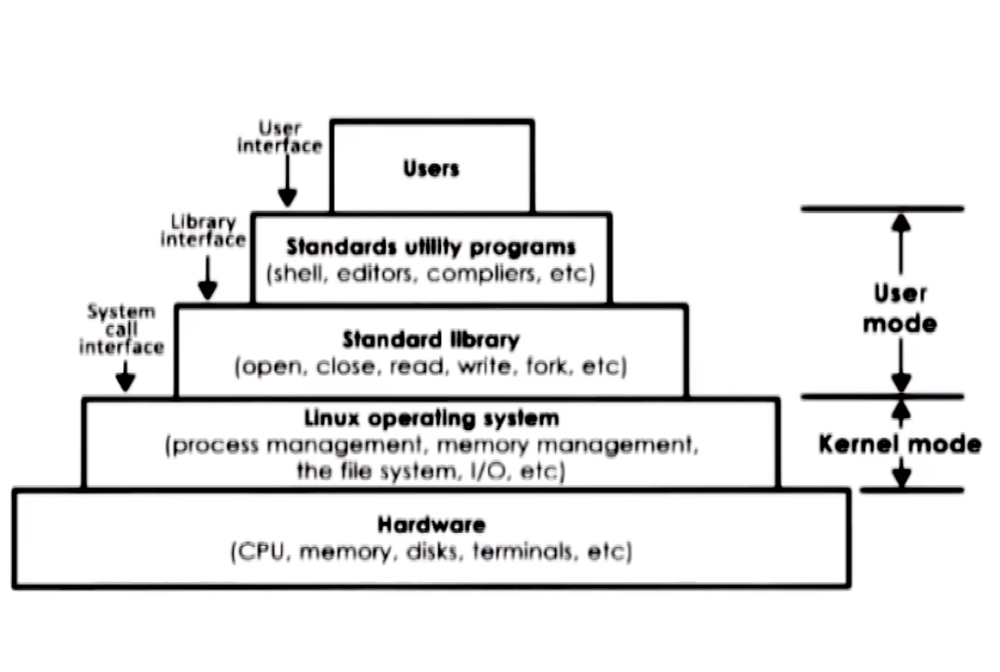

# Lesson 3 - Introduction to Operating Systems

## What's Covered?

* What is an Operating System?
* What is the role that it plays in Computer Systems?
* What are the key components?
* Design and implementaion of consideration of operating systems

## Simple OS Definition

Operating System - a piece of software that **abtracts** and **arbitrates** the underlying hardware system.

Abstract - to simplify what the hardware does, to make it generic across different types of hardware.
Arbitrate - to manage, to oversee details, to control the hardware use.

## Visual Metaphor

"An OS is like ... a toy shop manager":

* Directs Operational Resources
  * Controlling employee time
  * Which employee works on each task
  * Tools...
* Enforces Policies
  * Fairness - how employees have to share resources fairly when working on similar tasks
  * Clean-up - how to clean up after a task is finished
* Mitigate difficulty of complex tasks
  * Simplify operations
  * Optimize performance

Whereas an OS:

* Directs Operational Resources
  * Controls CPU, memory, peripherical devices...
* Enforces Policies
  * Fair resource access (e.g.: CPU, Memory, Disk...)
  * Set limits (e.g.: number of files open, threads, ...)
* Mitigate difficulty of complex tasks
  * Abstract hardware details (e.g.: system calls for memory management)

## What's an Operating System?

A layer of system software between applications and hardware that abstracts and arbitrates common tasks.

It:
* Has privileged access to the hardware
* Hides complexity (hardware specific)
* Manages hardware on behalf of one or more applications (according to policies)
* Provides isolation and protection between applications

```
                      Applications
    Internet Browser                   Text Editor
----------|---------------------------------|-------------
          |         Operating System        |
      send/recv                      Read/Write Files
     Network Socket                         |
          |            _____________________|
          |            |
          L____________|________
                       |       |
Scheduling--|          |       |
---|--------|----------|-------|--------------------------
  CPU   |  GPU  |  Memory  | Disk | Ethernet | USB Drives
````

### Quiz: Components, Abstraction, Arbitration

#### Which of the following are likely components of an operating system?

- [ ] File editor   (it's an application)
- [x] File system   (it abstracts blocks of disk storage into files)
- [x] Device driver (it abstracts decisions of the hardware device)
- [ ] Cache memory  (the OS doesn't manages it, the hardware does)
- [ ] Web browser   (it's an application)
- [x] Scheduler     (it's abstract CPU resources, pushing and pullling tasks that need computation)

#### Abstraction or Arbitration?
> [x] Abstraction | [ ] Arbitration

- [ ] distributing memory between multiple processes
- [x] supporting different types of speakers
- [x] interchangeable access to different types of HD or SSD

### Types of Operating Systems

Each OS is designed for different types of usage, that being a desktop, a laptop, a mobile phone, up to a server machine, or even a IoT device.

The focus of the classes is Desktop, with some bits of embedded.

## Elements

OS supports a number of higher level **abstractions**, such as:
 * Process
 * Thread
 * File
 * Socket
 * Memory Page

As well as a number of key **mechanisms** that operate on top of these instructions:
 * Create, Schedule (applications, e.g.: processes & threads)
 * Open, Write (Disk blocks/Files)
 * Allocate (Memory)

Finally, they also support **policies** to determine specifically how these will be used:
 * LRU (least recently used)
 * EDF (earliest deadline first)

### Memory Management Example

To manage memory, the OS uses a **memory page**, which corresponds to an addressable region of the memory of a fixed size, e.g.: 4 KB.

Application:
  * Request a page

Abstraction:
 * Memory Page

Mechanism:
  * Allocate (map it to a process)
    * It can be allocated to DRAM (which can be moved accross different physical locations)
    * It can be allocated on Disk

Policies:
  * Decides where it's better to store the memory space/page
    * LRU - Least Recently Used
      * During operation the OS can move the memory from RAM to Disk if for instance, it's not being frequently accessed by the application, to avoid that other applications run out of memory, for example.
      * LRU is an example policy that might help to decide when and what to move.

## Design Principles

* Separation between mechanism and policies
  * Implement flexible mechanism that can support a number of policies
    * Memory page - LRU, LFU, Random...
    * In different settings, different policies may make more sense
* Optmize for the common case
  * where will the OS be used?
  * what will the user want to execute on that machine?
  * what are the workload requirements?
  * e.g.:
    * A cloud machine that executes a web-server application might, for instance, require huge amount of memory almost no disk usage, so we should avoid at all costs to move memory to disk.
    * A mobile phone might want to save baterry and be reliable to turn on and off, so we might frequently backup memory to disk to that tasks can be restored. eventually.

## Protection Boundary
> User/Kernal Protection Boundary

Access to hardware is mostly done through the OS, with Kernel-level or Privileged access. Programs or applications usually run on User-Level, requiring to go to OS and request for access to specific hardware abstractions. There are ways around this, but usually a good OS would always supervision what happens, and even the hardware level has mechanism to prevent that unwanted instructions run without the approval of the OS. e.g.: if an app tries to run an specific instruction without explicit granted permission from the OS.

The OS export a system call interface, allowing the applications to request specific services or tasks from it.

* open (file)
* send (socket)
* malloc (memory)

Signals - a way of the OS to report notifications back to the applications

```
---------------------|--------------------------------
  Unprivileged Mode  |
    User-Level       |  APP 1  |  APP 2  |  APP 3
                     |
---------------------|--------------------------------
      Privileged     |
     Kernel-Level    | Operating System
                     |
---------------------|--------------------------------
                     |     Memory    |      CPU
---------------------|--------------------------------
```

## System Calls

````
User Level - system call    return from system call
                       |            |
-----------------------|------------|--------
Kernel Level       TMB = 0        TMB = 1
                      |             |
                      V             ^
                     execute system call
````

* TMB - trap mode bit

### Flow

1. User starts a process that request a system call for hardware access
1. The control is passed to the OS
1. Execution context switches (User->Kernel)
1. The OS will run in privileged mode (TMB=0)
1. Once the system call completes the OS handles back the controll
1. Execution context switches (Kernel->User)

### Observations

* The operation cam be given directly to a system call OR through a reference
* In synchornous mode the process waits for the system call to finish
* We'll see how to issue async calls

More information:
  * User/Kernel Space - https://minnie.tuhs.org/CompArch/Lectures/week05.html

## Service

Hardware level:
* Scheduler - Controll access to the CPU
* Memory Manager - Provices access and controlls memory (RAM)
* Block Device Driver - Provides access to a Disk, for instance

### Services vs System calls:

Process Controll

File Manipulation

| Service                 | Task                           | Unix System Call |
|-------------------------|--------------------------------|------------------|
| Process Control         | Create                         | fork()           |
|                         | Exit                           | exit()           |
|                         | Wait                           | wait()           |
| File Manipulation       | Open                           | open()           |
|                         | Read                           | read()           |
|                         | Write                          | write()          |
|                         | Close                          | close()          |
| Device Manipulation     | Set Console                    | ioctl()          |
|                         | Read Console                   | read()           |
|                         | Write Console                  | write()          |
| Information Maintenance | Get Process ID                 | getpid()         |
|                         | Set Time                       | alarm()          |
|                         | Sleep                          | sleep()          |
| Communication           | Create Pipe                    | pipe()           |
|                         | Create File Mapping            | shmget()         |
|                         | Map View of File               | mmap()           |
| Protection              | Set file security              | chmod()          |
|                         | Initialize Security Descriptor | unmask()         |
|                         | Set Security Descriptor Group  | chown()          |

### Quiz: System Calls

On a 64-bit Linux-based OS, which system call is used to...

1. Send a signal to a process? `KILL`
1. Set the group identity of a process? `SETGID` / `SETGID16/32`
1. Mount a file system? `MOUNT`
1. Read/Write System Paramters? `SYSCTL`

## Linux Architecture


