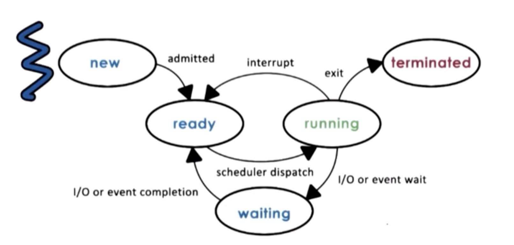
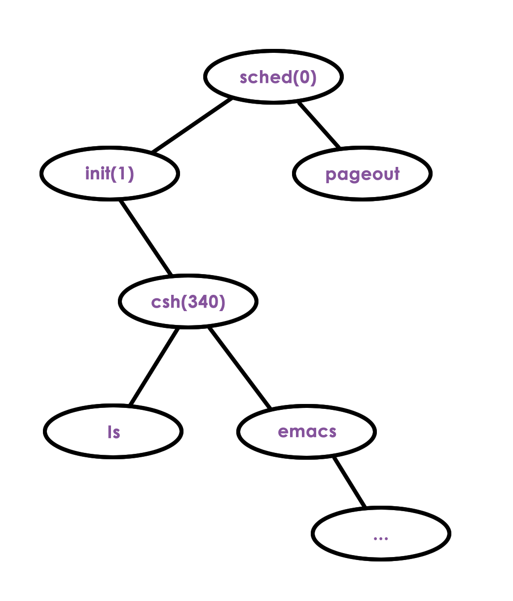

# Lesson 4 - Processes and Process Management

## What's Covered?

* What is a Process?
* How does the OS represents a procees?
* How does the OS manager multiple concurrent processes?

## Simple Definition

A process is an instance of an executing program.

## Visual Metaphor

Order of toys:
- State of execution
- Parts & Temporary holding area
- May require special hardware

Process - Computation request:
- State of execution: Program Counter, Stack
- Parts & Temporary holding area: Data, register, state in memory
- May require special hardware: I/O Devices

## What is a Process?

Application: program on disk, not executing, static entity.

Once an application is loaded in memory and executing it's a **process**.

If an application is ran multiple times, we have multiple processes.

The OS Manages hardware on behalf of applications.

#### What does a process look like?

In memory, the process content and state must be identifiable by an address, on the addresspace,

````
vMax    Stack
          |
          |
          |
          |
          |
        Heap
        data -----|___ Static State
v0      text -----|
`````

#### Types of process state

* Static
  * text - code
  * data - files/content
* Dynamic
  * Stack
    * LIFO (last in first out)
    * grows and shrinks
    * Stores code addresses, state, and well-known side elements
  * Heap - Continuous space in memory for dynamic growing random-access data.

#### Process address space

v0 to vMax are virtual representations of physical addresses in memory used by the process.

They don't have to correspond to real physical addresses since this mapping is done by the hardware and the OS. This is due to interventions that the hardware of the OS can do in order to improve performance, security or reliability of the whole system, also compliant to multi-tasking (e.g.: when different processes are dynamically requiring different amounts of memory...).

PageTables are the mappings between the real addresses and the virtual ones, given to each process.

### Address Space and Memory Management

On a 32bits system, the addresses can only represent up to 4GB, that's one of the many reasons why the OS defines which portion of the phisycal address is stored and represented by which address on the virtual one.

e.g.:

Imagine that the P1 required 1 address, then it ran for a while, soon after the P2 started and it required 4 addresses, followed by another P1 request and finally P2 required 1 more.

See:
```
virtual -- phisycal
  P1         P1
  P1         P2
  P2         P2
  P2         P2
  P2         P1
  P2         P2
```

From the process perspective, on the virtual mapping, the space is continuous, since the OS calculates a gap for such events, whereas in reality the memory is not necessairly managed that way.

**Important** to notice that virtual address space is also useful for specifying which process can perform a specific memory action, since the mapping is done by the OS.

### Quiz: Virtual Addresses Quiz

If two processes, P1 and P2, are running at the same time, what are possible virtual address space ranges they'll be given?

- [ ] P1: 0      - 32,000 | P2: 32,001 - 64,000
- [x] P1: 0      - 64,000 | P2: 0      - 64,000
- [ ] P1: 32,001 - 0      | P2: 0      - 32.000

Since we've decoupled the addresses from the phisycal ones implies that both processes could have the same "virtual address", but in reality being pointed to different locations on the real hardware.

## Process Execution State
> How does the OS knows what a process is doing?

For the OS to manage the processes it must have a way to know what is the process doing. e.g.: if the OS stops the process due to multitasking, it must know how to re-start it from the exact same point.

Once the code is compiled, it becomes a binary, or a sequence of instructions (that are not necessairly sequential).

Since the CPU needs to know where your program is, the CPU watches the Program Counter, or PC, and the Registers.

State
* Program Counter (PC) - Address of the current instruction to be executed by the OS. (Maintained by the CPU in a register, along with other registers).
* Registers - address of the parameters of the instruction
* Stack Pointer (SP) - Address of the stack

### What is the Proccess Controll Block (PCB)?

The Process Controll Block is a reserved space in memory where the OS store information necessary for the process management.

* Process State
* Process Number
* Program Counter
* Registers
* Memory Limits
* List of Open Files
* Priority
* Signal Mask
* CPU Scheduling Info
* ...

The PCB is initializer when the process starts and it's updated during the lifetime of the process...

#### How is a PCB used?

When the process initializes the PC is set to the first instruction on the process code, the CPU sets the next ones on its register but it's the OS job to collect and update that on the PCB.

The CPU registers correspond to the values of the current "running" process. When the OS decides to interrupt a process, for whatever reason, it must save the state of the same, including CPU registers, PC, and such into the PCB.  When the process is rescheduled/restarted by the OS, the OS then must then update back the CPU registers with the process, as well as everything else the process might need (Program Counter, ...)

This swap is called **context-switch**.

### Context Switch

A context switch is the mechanism of the operating system to switch the execution from the context of one process to another process.

This operation is expensive, for several reasons:

* Direct cost:
  * Moving from/to memory to the CPU
* Indirect cost:
  * Cache misses / Cold cache

#### Cache misses?

The processor has a pool of different cache layers, L0, L1, L2... each bigger than the previous in space but slower in speed. This is created in order to facilitate the processing of instructions, since the path from L0 to the CPU is a couple orders of magnitude faster than if it is fetching the same values from memory.

When the context switch happens, it's quite likely that the new process will endup overrinding the existing cache, and then the previous process is back running it will have a cold cache, having to fetch again things from memory.

### Quiz: Hot Cache Quiz

When a cache is hot...

- [ ] it can malfunctions so we must context switch to another process
- [x] most process data is in the cache so the process performance will be at its best
- [x] sometimes we must context switch

## Process Lifecycle

Processes can be either `running` or `idle`.

When a process is running it can be interrupted and context-switched, which leads it to a `ready` state, it is ready to execute but it is not the current process.

The scheduler, from the OS, will at some point schedule it again.



When a process was just created, it starts with the `new` state, the PCB is setup at this time. Eventually, it gets to a `ready` state, but it is not executed, it waits for the scheduler to dispatch it. Once this happens, it moves to `running`.

During running, a couple different things can happen. For instance, a context switch, which would move the program back to `ready`, as previously discussed. Another possibility is that the process needs IO, for a big file to be loaded, a HTTP request to be performed or likewise. The process then enters a `waiting` state, giving space to other process to use the CPU while it is waiting for IO, as soon IO returns it will be rescheduled and eventually run again.

Finally, the process might enter `terminated` state, due to it's task to have finished or even given an error or something of a kind.

### Quiz: Process State Quiz

The CPU is able to execute the process on which state(s)?

- [x] running - it is already executing
- [x] ready - it is just waiting on the scheduler
- [ ] waiting
- [ ] new

### Process Creation



There are 2 main mechanisms for creating a process:

* `fork`
  * copies the PCB of the parent process
  * both parent and child continue execution from the same point right after
* `exec`
  * it forks, but replaces the PCB
  * points the child to the first instruction

### Quiz: Parent Process Quiz

On UNIX-based OSs, which process is often regarded as "the parent of all process"?
> root-process

On Android, which process is often regarded as "the parent of all process"?
> zygote-process

## Role of the CPU Scheduler

The CPU scheduler determines which one of the currently `ready` processes will be dispatched to the CPU to start running, and how long it should run for.

```
                        CPU Scheduler  |
Queue              |                   |
                   |       CPU         | T
... P1 | P2 | P3   |                   | I
                   |                   | M
                   |                   | E
```

* preemtp  - interrupt and save current context
* schedule - run the scheduler to figure out what to run next
* dispatch - dispatch process and switch into its context

It's the CPU Schedulers' job to spend effiently the resources to **run processes** and not to run the above mentioned tasks, since they are just overhead.

### What about I/O?

Imagine a process made an IO request, the process is set to `wait` and it remains on the IO queue until the IO is performed/returned. Once it's returned, it goes to `ready`, eventually being picked up by the scheduler to run.

### Quiz: Scheduler Responsibility Quiz

Which options are NOT responsibility of the scheduler?

- [x] maintaining the IO queue - scheduler has no control over IO operations or when they'll occur
- [ ] maintaining the ready queue
- [ ] deciding when to context switch
- [x] deciding when to generate an event that a process is waiting on - same as I/O, no control external events

## Inter Process Communication - IPC

An OS must allow processes to interact to one another.

IPC allows data transfer between address spaces without compromising process isolation, they might be periodic, streaming, shared, each one having performance and flexibility trade-offs.


#### Message-Passing

- OS provides communication channel, like shared-buffer
- Processes can:
  - Read (recv)
  - Write (send)

```
|---------|              |--------|
|   P1    |              |   P2   |
|_________|              |________|
     |                        ^
     |      |---------|       |
     |----->| channel |-------|
            |_________|
```

* `+` OS manages it
* `+` Provides APIs to send/receive date
* `-` every piece of data must be copied to from P1-->channel-->P2

#### Shared-Memory IPC

- OS establishes a shared memory channel and maps into each process address space
- Processes directly read/write to the shared memory
- OS is out of the way after the setup

```
|---------|              |--------|
|   P1   *----------------*  P2   |
|_________|              |________|
```

* `+` OS is out of the way, no overheads
* `+` No need for copying
* `-` no defined APIs
* `-` can generates more concurrency/asynchronous errors since the state is shared

### Quis: Shared Memory Quiz

Shared-memory based communication performs better than message passing communication

- [ ] True
- [ ] False
- [x] It depends...

The individual data exchange is cheap, but the operation of mapping memory between 2 processes is expensive, so, the amout of messages must be worth it.
