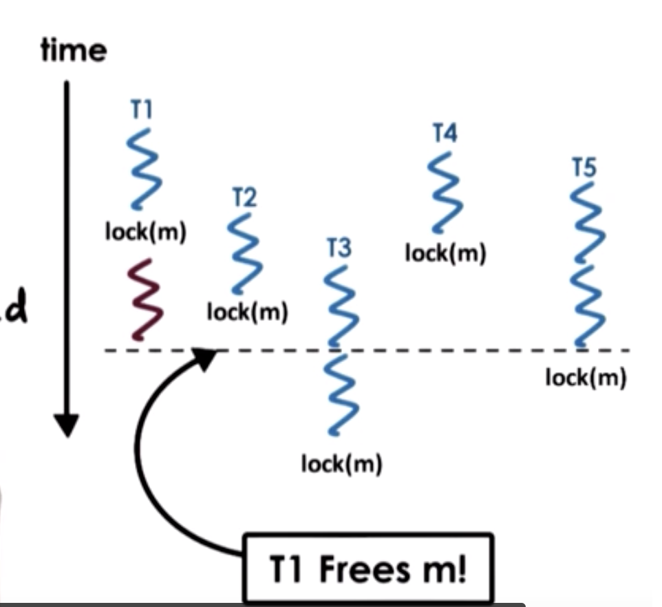

# Lesson 5 - Threads and Concurrency

## What's covered?

* What are threads?
* What's concurrency?
* How theads different from processes?
* What data structures are important to use and manage threads?

References:
* ["An Introduction to Programming with Threads"](https://s3.amazonaws.com/content.udacity-data.com/courses/ud923/references/ud923-birrell-paper.pdf) by Birrell

## Simple Definition

A thread is an instance of an executing program.

## Visual Metaphor

Toy shop worker:
- Active entity - executing a unit of toy order
- Simultaneously with others - many workers completing toy order
- Requires coordination - shares tools, workstations...

Thread - :
- Active entity - executing a unit of a process
- Simultaneously with others - many threads executing at the same time
- Requires coordination - sharing of I/O devices CPUs, memory...

## What is a Thread?

Threads represent multiple independent execution contexts, they share the same virtual address space, code, data, files. However, they might execute different things on different orders... so they need different PC, Stack and Registers. That's represented by a more complex PCB, having a shared state and per-thread execution context.

### Why are threads useful?

Divide to conquer!

Imagine a 4 CPU computer, where a vector with 1M entries needs to be multiplied, on each element by 5. We can split the vector in 4 parts of 250k elements and run that in parallel on each CPU/Thread.

FASTER RESULTS! Probably 4 times faster in this case, even more if you have "waiting" state in between.
```
 T0   T1   T2   T3
CPU0 CPU1 CPU2 CPU3
```

Also, we can prioritize different threads, and each thread can have processor cache for their own operations.

Why not simply use multi-process?

* IPC is more costly than L* cache
* Having multiple processes generates memory overhead (in space)
* More complex both on OS level and on code

Are threads useful on a Single-CPU? or when the number of threads is bigger than the number of CPUs?

* Yes, when you have IO for instance, the IO/idle thread.
* Threads are faster because the context switch doesn't have to recreate the mappingings for addresses ans such
* It allows us to hide latency on IO operations

### Quiz: Process vs Threads Quiz

Does it apply to P - Process, T - Threads, B - Both.

- [T] can share a virtual address space
- [P] take longer to context switch
- [B] have an execution context
- [T] usually result in hotter cache when multiple exist
- [B] make use of some communication mechanism

## Basic Thread Mechanisms

* Thread Data Structure
  * Identify and keep track of thread resource usage
* Create / Manage Threads
* Coordinate memory access
  * Guarantees that are no conflicts since they're on the same address space

The OS with the PCB manages to create isolation across process memory space, P1 cannot change memory of P2. When we are talking about threads, that execute concurrently, we need mechanisms to make sure that T1 and T2 do not have race conditions for memory entries.

One thread might try to read the data while another is writing, and that can leads to faulty results.

### Synchronizations Mechanisms

* Mutual Exclusion
  * **Mutex** - Mutual exclusion is one mechanism that allows exclusive resource access to one thread at a time.
* Condition Variables
  * Control variables to define if a thread must be executed taking into account other threads.

## Threads Creation (Theory)

* Thread Type
  * Thread ID, PC, Register, Stack Pointer, data, attributes (for scheduling purposes)
  * Creation
    * fork(proc, args)
      * Not UNIX fork
      * T0 forks to T1, the "PCB" of the thread is copied and the PC is set to the same instruction and they execute concurrently.
      * When T1 finishes, it can write the result to memory, but how do we know it is finished?
    * join(threads)
      * we need to guarantee that the main thread ("owner" of the process) won't finish before the other threads do, so we can ensure their work is done.
      * when we call join, the executing thread waits until the threads given as argument are finished, so we ensure the above mentioned.

#### Example of thread creation

```
Thread thread1;
SharedList list;
thread1 = fork(safe_insert, 4);
safe_insert(6);
join(thread1); //Optional
```

```
     t0
     |
  t1 = fork... --------- t1
     |                    |
     |               safe_insert(4)
  safe_insert(6)
     |
   join(...)
```

There is no way to ensure, on the above scenario, that safe_insert 6 will run before 5.
The list can be either

* `4->6->nil`
* `6->4->nil`

The join only ensures that safe_insert 4 runs, if already ran it return immediately.

## Mutexes

### Problem: How is the list updated?

```
list --> value|p_next
```
the list is composed of a series of `values` and `pointer` tuples. When the list has to be updated, a thread takes the pointer and points to a new value. If a thread is to be updating at the same time as the other, it could generate a state where instead of 2 new elements, we could have 1 only. They might both read the same value of the list for `p_next` and then take turn setting the value of the last one... 1 get's inserts 1 is lost.

Mutex helps to solve this, by saving a "lock" flag, making it exclusive to the owner thread.

The mutex stores also the owner and a ordered list of blocked threads. The blocked threads have to wait.

e.g.:

Birrel's API:
````
lock(mutex) {
  mutex.counter += 1
} // lock releases
````

Common C API
````
lock(mutex)
mutex.counter += 1
unlocl(mutex)
````

### Mutex Example

```c
list<int> my_list;
Mutex m;

void safe_insert(int i) {
  Lock(m) {
    my_list.insert(i)
  } //unlock
}
```


### Quiz: Mutex Quiz



We have 5 threads, T1-5, and the have 1 mutex.

T1 is the first one to get access, which thread gets the lock, right after T1 releases it?

- [x] T2 - it's request is already waiting for the lock, it will get it
- [ ] T3 - Not a likely candidate, since T5 is timeline-wise coming first
- [x] T4 - it's request is already waiting for the lock, it will get it
- [x] T5 - T5 can lock the request on another CPU even before T2/T4 can get a change to do it

## Producer and Consumer Example

What it the mutual exclusion only needs to happen under certain conditions... say for instance that any thread can read the list but only a single thread at a time can write to it...

```
Producer | ---> | 9, 8, 7, 6, 5, 4, 3, 2, 1, 0 | Consumer
                  |                |_________________|
Producer |--------|
```

```
for i=0..10
  producers[i] = fork(safe_insert, NULL) //create producers

consumer = fork(print_and_clear, my_list) //create consumer

//producer insert
lock(m) {
   list->insert(my_thread_id)
}

//consumer print_and_clear
lock(m) {
  if my_list.full -> print; //-> ensures the other threads are finished by checking if it's full
  else -> release and try again (later) // return the execution control, or the lock, to the producer threads
}
```

The above code, is wasteful.

### Condition Variable

We can adjust the previous code to:

**Producer**
```
lock(m) {
   my_list.insert(my_thread_id);
   if my_list.full()
     signal(list_full);
} // unlock
```

**Consumer**
```
lock(m) {
  while (my_list.not_full()) {
    wait(m, list_full); // wait must release the lock while the list is not full
  }
  my_list.print_and_remove_all();
} // unlock
```

#### API

* Condition Type
  * list of waiting threadds
  * mutex reference
* `wait(mutex, cond)`
  * mutex is released and re-acquired on wait
* `signal(cond)`
  * Notify only the thread waiting
* `broadcast(cond)`
  * notify all waiting threads

### Quiz: Condition Variable

Instead of `while`, why didn't we use `if`?

```
lock(m) {
  while (my_list.not_full()) {
    wait(m, list_full); // wait must release the lock while the list is not full
  }
  my_list.print_and_remove_all();
} // unlock
```

- [ ] while can support multiple consumer threads?
- [ ] cannot guarantee access to m once the condition is signaled?
- [ ] the list can change before the consumer gets access again?
- [x] all the above?

The while guarantees that once it is "awakened" it must re-check the full state since the state could've changed between the signal and the re-scheduled execution...
That supports multiple consumers!

## Readers/Writers Problem

The problem is that both readers and writers are trying to access the same resource, say a file.

The common solution, is to have a mutex wrapping the file, which works well for the writer, but not for the readers.

```
if reader_count == 0 and writer_count == 0
  read_ok, write_ok

if reader_count > 0
  read_ok

if writer_count == 1
  read_not_ok, write_not_ok
```

State of the shared file/resource:

* `free`: resource_counter = 0
* `reading`: resource_counter > 0
* `writing`: resource_counter = -1

#### Example

**READER**
```
lock(counter_mutex) {
  while(resource_counter == -1) {
    wait(counter_mutex, read_phase);
  }
  resource_counter++;
} // unlock

// ... READ DATA ...

lock(counter_mutex) {
  resource_counter--;
  if(resource_counter == 0) {
      signal(write_phase);
  }
} // unlock
```

**WRITER**
```
lock(counter_mutex) {
  while(resource_counter != 0) {
    wait(counter_mutex, write_phase);
  }
  resource_counter = -1;
} // unlock

// ... WRITE DATA ...

lock(counter_mutex) {
  resource_counter = 0;
  broadcast(read_phase);
  signal(write_phase);
} // unlock
```

* The access to the file is not really controlled with lock, yet by checking the `resource_counter`, which then is protected by a mutex, the `counter_mutex`.
* Before writing we must ensure that the `resource_counter` is -1, then we release and `broadcast` a `read_phase` signal
* The reader checks the counter for the presence of a writer, if none is present, meaning the resource_counter >= 0, then it registers itself, reads the data and unregisters itself, AND if there are no other readers it sends a write_phase signal.
* The writer, when finished writing, sets the counter to zero, wakes up all the reader threads and also itself as a writer thread, as a loop

## Common Pitfalls

* Keep track of all mutexes - e.g.: mutex_type m1;
* Check that you are always using lock and unlock - e.g.: Did you forget to unlock?
* Use a single mutex for a single resource;
* Signal correctly;
* Do not use signal when you need to use broadcast;

### Spurius Wake Ups

Unnecessary wake ups, doesn't impact correctness but yet performance.

**Writer**
```
lock(counter_mutex) {
  resource_counter = 0;
  broadcast(read_phase);
  signal(write_phase);
} // unlock
```

**Reader**
```
wait(counter_mutex, read_phase)
```

The broadcast is signaled while the lock is still held by the writer, which leads the scheduler to awake threads that will execute just to realise then can't have the lock still...

Can we unlock before signaling? Sometimes

**New Writer**
```
lock(counter_mutex) {
  resource_counter = 0;
} // unlock

broadcast(read_phase);
signal(write_phase);
```

Works well, because the signaling is not conditioned. However, here:

**Some Reader**
```
lock(counter_mutex) {
  resource_counter--;
  if (resource_counter == 0)
    signal(write_phase);
} // unlock
```

Here the signaling is conditioned by the resource_counter value, which is only readble with a lock being held...

### Deadlock

Competeing threads are each waiting on each-other to complete, but they never do since they are waiting on each-other.

Imagine 2 Threads, T1 and T2, which need to perform operations on variables A and B.

```
  T1               T2
  |                 |
lock(m_A)        lock(m_B)
  |                 |
lock(m_B)        lock(m_A)
  |                 |
 ...               ...

```

In this scenario, T1 holds the lock for A, while T2 is holding the lock for B, when they move to the next step, T1 is waiting for the lock of B to be released, since it's held by T2, and T2 is waiting for the lock of A which is held by T1, neither thread can proceed.

How to avoid?

* mega lock, A-B
* best solution: maintain a lock order

### Quiz: Critical Section Quiz

ToyShop can have new orders or old order processing.

At any point in time:
- max of 3 new orders can be processed
- if only 1 new order is being processed, then any number of old orders can be processed

- [x] `while ((new_order == 3) OR (new_order == 1 AND old_order > 0))`
- [ ] `if ((new_order == 3) OR (new_order == 1 AND old_order > 0))` - Incoming threads must ensure the predicate is re-evaluated since values might change
- [ ] `while ((new_order >= 3) OR (new_order == 1 AND old_order >= 0))` - `>= 0` doesn't work for old orders, since there could be 0 and we should proceed
- [x] `while ((new_order == 3) OR (new_order == 1 AND old_order > 0))`

## Kernel vs User Level Threads

* Kernel level threads are managed by the Kernel and CPU Scheduler
* For a User level Thread to run, it must be associated with a Kernel Thread

### One-to-One model

1 user-level thread is equivalent to 1 kernel thread

* `+` OS sees and understands threads synchronization/blocking...
* `-` expensive since we must cross user/kernel boundaries
* `-` OS might limit policies and thread management

### Many-to-One model

Multiple user-level threads are mapped to 1 kernel thread

* `+` Thread management on the user level, highly portable
* `+` No limits on policies or kernel specific
* `+` Thread management on the user level
* `-` OS has no insights into the application needs
* `-` OS might block the whole process if an I/O is blocking within a thread

### Many-to-Many model

Multiple user-level threads are mapped to multiple kernel threads

* `+` Best of both worlds
* `+` No blocking because of a single I/O
* `+` Bound/Unbound threads
* `-` Requires coordination between Kernel and User

## Multithreading Patterns

Toy Shop Application

1. Accept the order
2. Parse the order
3. Cut the wooden parts
4. Paint and Decorate
5. Assemble
6. Ship the order

### Boss/Workers

* Boss: Assigns tasks
* Workers: Perform tasks

In this model, we have only 1 boss, therefore the throughtput is limited by the boss performance.

Boss can assign workers by:
- directly signaling - the boss waits. The workers don't need to sync, but the boss has to keep track of everything and makes it all slow.
- queue - the boss sets a queue, the workers listen to the queue. Boss doesn't wait to the queue, the workers consume the queue independently. But, now, the workers must synchronize access to the queue.

**How many workers is enough?**

Adding more workers can consume the queue faster, but put backpressure on other parts of the system, or even in many cases, can be useless since the resource is shared and it can't be handled by multi-threads at the same time. A good model would be to have a pool of workers, and use them on demand rather than creating them on demand.

In general, the boss/workers:

* `+` simplicity
* `-` queue management
* `-` locality - it can't optmize for worker specialization, resources that are "close" or "cached" might be useful, but the boss would need to know
  * Overall you would have different queue for each specialized worker, which might increase the probability cache hits, increasing performance.
  * The locality increase the complexity on queue and thread pool management.

### Pipeline Pattern

In this scenario, each order is subdivided in to multiple steps, which are sequencially executed. Each step is taken care by a worker that, waits for the previous steps and holds the next one. The resource goes throught the system as if it were on a pipe, step by step, until the last task is performed.

The performance will be given by the slowest step, however, if it is possible to paralelize per "request", we can easily scale up.

* `+` highly specialized threads
* `-` complex to maintain the pipeline, if the work changes we have to rebalance the entire pipeline

### Layered Pattern

Each layer group related tasks and subtasks.

* Decorating - Step 4
* Assembling - Steps 3,5
* Processing - Steps 1,2,6

* `+` Highly specialized
* `+` Less complex to configure pools ans such
* `-` Less likely to be compatible with all applications
* `-` Synchronization more complex, since it can go to multiple layers back and forward

### Quiz: Multithreading Patterns Quiz

For the Toy Shop Application, let's evaluate 2 solutions, `1) boss-workers` and `2) pipeline`. Both have 6 threads.

- In the boss worker solution, each worker takes about `120ms` to process the order.
- In the pipelined solution, each steps takes about `20ms`.

How long will it take for these applications to perform 10 toy orders?

- Boss-workers (10): (120) + (120) = 240
- Boss-workers (11): (120) + (2 * 120) = 360
- Pipeline (10): (6 * 20) + (9 * 20) = 300
- Pipeline (11): (6 * 20) + (10 * 20) = 320

The performance depends on the input.
