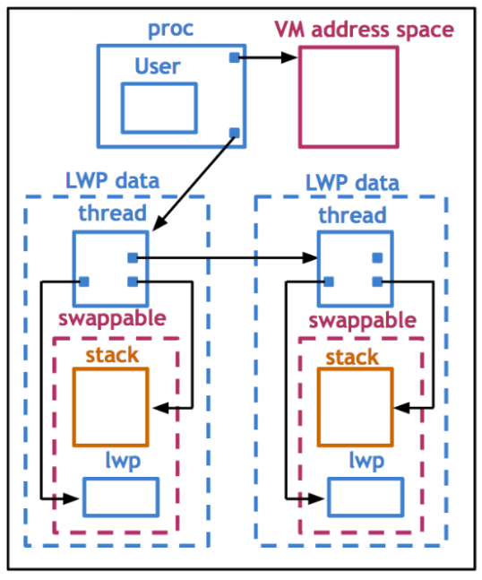

# Lesson 8 - Thread Design Considerations

Reference Links:

* https://s3.amazonaws.com/content.udacity-data.com/courses/ud923/references/ud923-eykholt-paper.pdf
* https://s3.amazonaws.com/content.udacity-data.com/courses/ud923/references/ud923-stein-shah-paper.pdf

## Kernel vs User-level Threads

* Kernel
  * Internal scheduler/synch/abstraction
* User-Level Threads
  * Managed by a library or the application itself
  * The library must provide a data structure, scheduling, thread abstraction, sync...
  * Different processes might use different user-level thread libraries

### Thread Data Structure: Single CPU

* 1 process
  * 1 CPU
    * Multithreads (User-Level Thread) (ULT)
    * 1 Kernel level thread (KLT)
    * 1 PCB
      * The PCB is broke down to multiple stack/registers for each thread

### Thread Data Structure: At Scale

* N processes
  * N CPUs
    * Multithreads (User-Level Thread) (ULT)
    * N Kernel level threads (KLT)
        * CPU Information
    * N PCB
      * The PCB is broke down to multiple stack/registers for each thread

### Hard and Light Process State

When switching contexts from thread to thread, of the same process, there are some parts of the PCB we might want to keep in memory across the kernel level threads that we are executing on the user-level.

We split that into **Hard** and **Light** process state.

* Light
  * Signal Mask
  * Sys call args...
* Hard
  * Virtual Address Mappings

### Single vs Multiple Data Structures for PCB

* Single Data Structures
  * Large Continuous Data Structure
  * Privacy for each Entity
  * Save and Restore on each context switch
  * Update for any changes
  * `-` scalability
  * `-` performance
  * `-` overhead
  * `-` flexibility
* MultipleData Structures
  * Smaller Data
  * Easier to Share
  * Restore is minimal during context switch (only the necessary portions)
  * User-Level Library need to update only portions of the state
  * `+` scalability
  * `+` performance
  * `+` overhead
  * `+` flexibility

OSs usually adapted the second option, for obvious reasons! :D

### Quiz: Thread Structure Quiz

`Version: 3.17 of the Kernel`.

* 1 - What is the name of the Kernel Thread Structure for Linux? (C Struct)
  * `kthread_worker`
* 2 - What is the name of the data-structure contained in the above struct that describes the kernel thread is running?
  * `task_struct`

Reference: https://elixir.bootlin.com/linux/v3.17/source/include/linux/kthread.h

## User-Level Structures in Solaris 2.0


* LWP - Light Weight Process
* Multi-CPU
* Multi-Kernel-Level Threads
  * Many-To-Many && One-To-Many mappings are supported

* Thread
  * Not POSIX, but Similar
  * `thread_create`
    * Does not return a `tid`, yet a pointer
    * Table has a per-thread data-structure
  * Thread Data Structure
    * Execution Context
    * Registers
    * Signal Mask
    * Priority
    * Stack Pointer (SP)
    * Local Storage (Variables defined at thread functions, defined on compile time)
    * Stack - Stack growth can be dangerous
      * Solution - red-zone (tries to write to an address on the redzone, the OS will know about it)

## Kernel-Level Structures in Solaris 2.0

* Process
  * List of kernel-level threads
  * Virtual Address Space
  * User-Credentials - Does the user have access to the files is trying to access?
  * Signal-Handlers - Events that can occurr
  * LWP - Light Weight Process
    * User Level Registers
    * System call Args
    * Resource Usage Info
    * Signal Mask
    * Similar to ULT, but visible to the kernel (not needed when process not running)
  * KLT
    * Kernel-Level Register
    * Stack Pointer
    * Scheduling info (class, priority...)
    * Pointer to associated LWR, Process, CPU Structures
    * Available even when the thread is not runnning
  * CPU
    * Current Thread
    * List of KLT
    * Dispatching & Interrupt handling info

Relations between these data structures:



## Basic Thread Management Interactions

Scenario:

* 4 ULT
 * 2 of the ULT are waiting for IO and 2 executing
 * 2 KLT requested (it must requests)
   * `set_concurrency` syscall
  * when the 2 KLT are blocked, the whole process is blocked, but there are ULT are free
  * The Kernel could've notified the ULL (User Level Library)
  * The ULL can then request more KLT from the Kernel so that the 2 free threads can run, instead of blocking the whole process

### Quiz: PThread - Kernel Interactions Quiz

* 1 - In the pthreads library, which function sets the concurrency level?
  * `pthread_setconcurrency()`
* 2 - For the above, which concurrency value instructs the implementation to manage the concurrency level as it deems appropriate (integer)?
  * `Specifying new_level as 0 instructs the implementation to manage the concurrency level as it deems appropriate.`

### Thread Management Visibility and Design

* The ULT can be `pinned` to a KLT.
* If a ULT has a lock, which is picked up by the KLT, but then gets send to waiting, while the internal CPU scheduler needs to do other things, the ULT blocks all other threads that might need that lock to work...
  * Lack of Visibility - The library makes scheduler decisions that the Kernel is now aware of, as much as the Kernel does the same

### Issues on Multiple CPUs

* 3 ULT
  * Priority T3 > T2 > T1
  * T2 has a lock
  * T3 wants the mutex (and it has more priority)
  * T2 releases the block, while T1 and T2 are actually running on each CPU
  * Since T1 has the lowest prio, and T3 is ready to run, we should preempt T1, but it's running on another CPU
  * We need to notify that CPU.
  * The ULL must send an interrupt signal to the that CPU so that it can schedule properly

### Synchronization-Related Issues

* 4 ULT
  * T1 ULT has a lock
    * runs on CPU 1
  * T4 ULT also needs same lock as T1
    * runs on CPU 2
    * should wait on the queue for the mutex
    * We should use Adaptative Mutexes:
      * Don't block, spin! (if the critical section is short)

* Thread Deletion
  * Once a thread is no longer needed, it's data structure should be destroyed. Instead, we mark them for the death-row.
  * Periodically, the reaper threads kills them (frees from memory)
  * However, we can re-use the threads, if a new thread is created before the reaper, we avoid freeing and re-allocating by just reusing or overriding death-row threads.

### Quiz: Number of Threads Quiz

* 1 - In the Linux Kernel's codebase, a minimum of how many threads are needed to allow the system to boot?
  * 20 threads, init for function, `fork.c`.
* 2 - What is the name of the variable to set this limit?
  * `max_threads`

## Interrupts vs Signals

Interrupts are:
- events generated externally by components other than the CPU (I/O devices, timers, other CPUs).
- determined by the physical hardware
- asynchronous

Signals are:
- events triggered by the CPU or Software running on it
- determined by the OS
- synchronous and asynchronous

Both:
- Have an Unique ID (depending on hardware & OS)
- Can be masked (and disabled/suspended)
  - per CPU mask (Interrupts are delivered per CPU), per-process mask (Signals are delivered to specific processes)
  - If the handler is enabled
    - Signals interrupt the process
    - Interrupts interrupt the CPU / entire system

### Interrupt Handling

* When a disk wants to send a notification to the CPU, it sends a signal through the interconect, called MSI, Message Singal Interrupter.
* The interrupt interrupts the execution of the present thread, and sets the program counter to the point in memory where the interrupt handler is set to.
* The OS keeps a table with interrupt signals and address pointer, so that hardwares can register their own interrupt.
* The hardware defines the signal code, whereas the operating system keeps a reference of what to do when that interrupt happens.

### Signal Handling

* Not generated by an external entity
* i.e.: if a program tries to access a part of the memory where it doesn't have access to, the os sends back a SIGSEGV
* The program jumps to the execution of that signal handling, similar to interrupts, but this time the process can specify how some signals are handled...
* Default actions
  * Terminate and Ignore
  * Core Dump and Terminate
  * ..
* Custom Handlers
  * signal(), sigaction(),...
  * some signals cannot "be caught" (the os doesn't accept overring actions)
* Types
  *  Synchronous
    * SIGSEV (access protected memory)
    * SIGFPE (divided by zero)
    * SIGKILL (kill, id)
    * SIGSEV (access protected memory)
  *  Asynchronous
    * SIGKILL (kill)
    * SIGALARM

#### Why Disable Signals/Interrupts

Threads/Processes can choose to temporairly disable interrupts or signals via masks, that to avoid deadlocks and such, when for instance the handler code must use the lock or similar...

#### More to masks

Signal/Hardware Interrupts masks reach a hardware level, the masks will make so that the interrupt won't reach the CPU depending on the way the mask is configured.

#### Multi-CPU

* Interrupts can be routed to a single CPU

### Types of Signal

* One Shot Signals
  * If there are multiple instances they'll be handled at least once
    * "1 == N" executions
    * More than 1 ocurrences must be re-configured, if the process wants a custom handler, otherwise the OS will run it's own
* Real-time Signals
  * Signals are queued rather than on a 1 time basis.

### Quiz: Signals Quiz

Lookup the signal names for the following events:

* Terminal Interrupt signal: `SIGINT`
* High bandwidth data is available on a socket: `SIGURG`
* Background process attempting write: `SIGTTOU`
* File size limit exceeded: `SIGXFSZ`

Source: http://pubs.opengroup.org/onlinepubs/9699919799/

## Task Struct in Linux

Linux implements a 1:1 model, rather than past implementations of M:M models.

Task is essencially the execution context of a kernel level task.

```c
task_struct {
  pid_t pid; // process or parent process
  pid_t tgid; // thread/task ID
  int prio;
  volatile long state;
  struct mm_struct *mm;
  struct files_struct *files;
  struct list_head *tasks;
  int on_cpu;
  cpumask_t cpus_allowed;
}
```

* `clone(function, stack_ptr, sharing_flags, args)`
  * sharing_flags: which state will be shared between the process and the thread/process;
