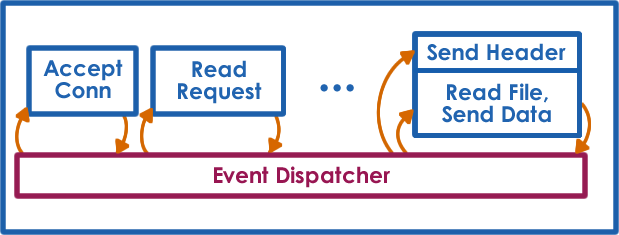
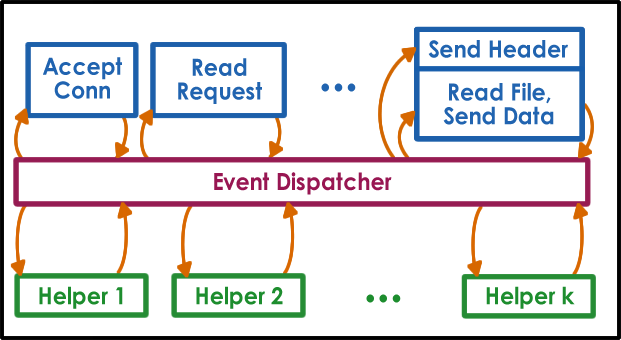

# Lesson 9 - Thread Performance Considerations

References:

* [Flash Web Server](https://s3.amazonaws.com/content.udacity-data.com/courses/ud923/references/ud923-pai-paper.pdf)

## Which Model is Better?

* The Boss-Worker model has a better avg. Time to complete an order while the Pipeline has a better overall completion time.

## Are threads useful?

* Parallelization => Speed up
* Specialization => hot cache!
* Efficiency => lower memory requirement, cheaper synchronization, hide I/O latency


Eveything will be based on the perspective of metrics of each application, e.g.: response time, throughput, ...

## Performance Metrics

* Metrics - a measurament standard, measurable
  * a quantifiable property of the system we're interested in that can be used to evaluate the system behavior.

Example metrics:

* execution time - "how long to finish a task"
* throughput - "how many tasks given a period of time"
* wait time - "how long waiting required to start a task / be executing a task"
* request rate - "how many requests given a period of time"
* cpu utilization - ...
* platform efficiency - "how many machines are required to perform such task"
* cost-bennefct - performance/$ - "how much I pay for each task or step of each task"
* percentage of SLA violation - Service Level Agreement - "how many tasks went over the 10s threshold"
* client-perceived performance - "how many tasks does the customer expect to see/accomplish vs actual tasks performed"
* aggregate performance - "how many tasks * how many users ratios"

## Really... Are threads useful?

* It depends on metrics
* It depends on workload

## How to provide concurrency?

### WebServer: Threads vs Processes

e.g.: a file server.

**What does a webserver do?**

1. client/browser sends the request
2. browser accepts the request
3. server processing steps
  * Accept connection (IO bound)
  * Read Request (IO bound)
  * Parse Request (CPU intensive)
  * Find File (IO bound)
  * Compute Header (CPU intensive)
  * Send Header (IO bound)
  * Read File (IO bound)
  * Send File (IO bound)
4. server respond by sending file

### MP - Multi Process WebServer

```
Process 1
  * Accept connection
  * Read Request
  * Parse Request
  * Find File
  * Compute Header
  * Send Header
  * Read File
  * Send File
...
Process N
  * Accept connection
  * Read Request
  * Parse Request
  * Find File
  * Compute Header
  * Send Header
  * Read File
  * Send File
```

* + Simple Programming
* - High Memory Usage
* - Costly Context Switch (copying memory tables, overriding CPU caches...)
* - Hard to maintain shared state
* - Tricky Socket Port Setup

### MT - Multi Thread WebServer

```
  * Accept connection (T1) - Accept Connection (TN)
  * Read Request (T1) - Read Request (TN)
  * Parse Request (T1) - Parse Request (TN)
  * Find File (T1) - Find File (TN)
  * Compute Header (T1) - Compute Header (TN)
  * Send Header (T1) - Send Header (TN)
  * Read File (T1) - Read File (TN)
  * Send File (T1) - Send File (TN)
```

* + Shared address space
* + Share State
* + Cheap context switch
* - More complex programming
* - Requires Synchronization
* - Support for Threads

### ED - Event Driven Model



* Event Dispatcher
  * Single Process
  * Single Shared Memory Space
  * Sinigle Thread of Control
* Dispatch Events
  * New Request
  * Receipt of the Request
  * Completion of a Send
  * Completion of a Disk Read Operation
* Handler Execution is a JUMP ;)

#### Concurrency in the Event Driven Model



* Similar to a State Machine - The main catch is that a event-driven system won't block on IO, it will iniciate the IO operation and trigger an event passing control to the dispatcher. That way, there is no IO await holding the whole program. When the IO operation finishes a new event is triggered, returning control to the event dispatcher for the next state of, let's say a request.

At the lowest level, the code needs to be triggered by events on sockets, files, and such. Luckly, both are represented in the OS by file descriptors.

An event for this service would be and input on the given file descriptors.

To figure out which file descriptor changed we can use both `select()` or `poll()` system calls.

Unfortunately, those calls can be expensive if there are a lot of file descriptors, more recently `epoll()` is available for Unix based systems.

What's the benefit of having a single thread for events:
* No need for synchronization
* no need for context switch
* single address space

